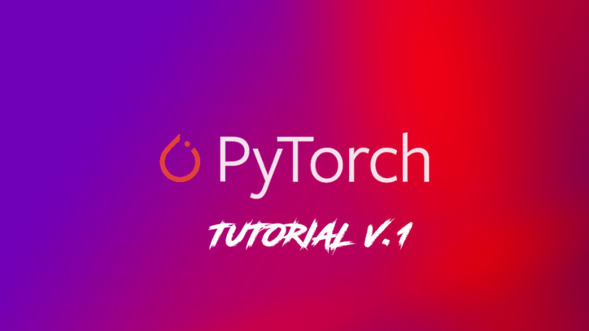

<h1 align="center">
   
  
</h1>

  <a href="#about">About</a> •
  <a href="#table-of-contents">Contents</a> •
  <!-- <a href="#features">Features</a> • -->
  <a href="#credits">Credits</a> •
  <a href="#support">Support</a>

---

## About

This repository supplies code and tips for deep learning's researchers and/or pratictioners who crave to learn <a href="https://pytorch.org/">Pytorch</a>. It's based on <a href="https://pytorch.org/tutorials/beginner/deep_learning_60min_blitz.html">Pytorch Deep Learning begginers' tutorial</a>, <a href="https://www.youtube.com/watch?v=c36lUUr864M">Python Engineer's Deep Learning with Pytorch free course</a>, and my own notes. I'll update it frequently, adding features not only restricted to the field of Deep Learning, but also from the more broad AI field. Hope you enjoy!

## Table of Contents

<ol>
  <li>Installation</li>
  <li>Basics
    <ol>
      <li>Tensors</li>
      <li>Autograd</li>
      <li>Backpropagation</li>
      <li>Gradient Descent</li>
      <li>Softmax and Crossentropy</li>
      <li>Activation Functions</li>
      <li>Training Pipeline</li>
      <li>Dataset and Dataloader</li>
      <li>Dataset Transforms</li>
    </ol>
  </li>
  <li>Supervised Learning
    <ol>
      <li>Linear Regression</li>
      <li>Logistic Regression</li>
      <li>Feedforward Neural Networks</li>
      <li>Convolutional Neural Networks</li>
      <!-- <li>Recurrent Neural Networks</li> -->
    </ol>
  </li>
  <li>Unsupervised Learning
    <ol>
    </ol>
  </li>
  <li>Reinforcement Learning
    <ol>
    </ol>
  </li>
  <!-- <li>
    <ol>
    </ol>
  </li> -->
  <li>Transfer Learning</li>
  <li>Tensorboard</li>
  <li>Save and Load Models</li>
</ol>

<!-- ## Features -->

## Credits

## Support
